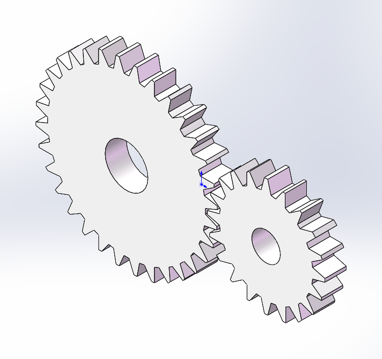

# SolidWorks AI Bridge

> 让本地 AI Agent 通过 SolidWorks COM 接口连接、驱动并自动生成 CAD 模型。

## 语言 / Language

- [中文](README.md)
- [English](README_en.md)

## 这个项目是什么？

`solidworks-ai-bridge` 是一个面向本地 AI 编程 Agent 的轻量级 Skill，用于把 Codex、Claude Code 等工具连接到本机 SolidWorks。

它的核心不是重新发明 CAD 内核，而是走 SolidWorks 官方开放的 Windows COM Automation 接口：

```text
SldWorks.Application
```

这样 AI Agent 就可以在你的电脑上完成这些事情：

- 连接已经打开的 SolidWorks
- 在 SolidWorks 未打开时尝试启动它
- 检查并安装 Python 依赖 `pywin32`
- 自动创建测试零件，验证连接链路
- 后续扩展参数化建模、STEP/Parasolid 导出，并衔接 Ansys Fluent、Ansys Mechanical、COMSOL Multiphysics 等仿真软件

## 示例：真实 SolidWorks 导出的测试零件

下面图片来自脚本创建的 SolidWorks 测试零件，并通过 SolidWorks COM 自动导出。这个齿轮对示例用于验证 sketch 轮廓、相位关系、多特征拉伸、中心孔和视图导出是否正常。

<p align="center">
  
</p>

GitHub 仓库只保留这一个复杂示例图，README 保持聚焦。

## 适合谁使用？

这个项目适合正在尝试把 AI Agent 接入工程软件流程的人，尤其是：

- 想让 AI 自动驱动 SolidWorks 建模
- 想做参数化 CAD 自动生成
- 想把 SolidWorks 建模接到 Ansys Fluent、Ansys Mechanical、COMSOL 或其它 CAE/CFD 流程
- 想让 Codex、Claude Code 等本地 Agent 执行真实工程软件操作
- 想先打通“AI -> SolidWorks -> 几何导出”的第一步

## 环境要求

- Windows
- 已安装并授权的 SolidWorks
- SolidWorks COM 接口已正常注册
- Python 已加入 `PATH`
- AI Agent 具备本地命令行执行权限

> 注意：SolidWorks 是商业软件，本项目不会、也不能自动安装 SolidWorks。请通过 Dassault/SOLIDWORKS 官方安装器、学校/公司软件中心或管理员提供的软件包安装。

## 可使用版本

已测试通过：

```text
SolidWorks 2024
RevisionNumber = 32.5.0
```

预期可用：

```text
SolidWorks 2020-2025 Windows 桌面版
```

更准确地说，只要本机 SolidWorks 能暴露下面这个 COM Automation 入口，就可以尝试使用：

```text
SldWorks.Application
```

不保证适用：

- SolidWorks Online / 浏览器版
- 3DEXPERIENCE 云端环境本身
- macOS / Linux
- 没有本地 Windows COM 权限的远程 AI
- 未激活、COM 未注册或被公司权限策略限制的 SolidWorks
- 很老的 SolidWorks 版本，部分 API 参数可能不同

## 版本路线

| 版本 | 状态 | 说明 |
| --- | --- | --- |
| v0.1 | 当前第一版 | 打通 AI Agent 通过 SolidWorks COM 连接本机 SolidWorks、创建测试零件、导出预览图，并默认关闭生成文档以减少内存占用。 |
| 后续版本 | 持续优化 | 根据实际使用反馈继续优化，包括更复杂的参数化建模、工程级齿轮/曲面/流道示例、STEP/Parasolid 导出、Ansys / COMSOL 等仿真软件衔接流程。 |

## 安装到 Codex

最简单的方式是直接把这个仓库发给支持本地命令执行的 AI Agent：

```text
帮我从 Mochaxgcc/solidworks-ai-bridge 安装 SolidWorks AI Bridge skill，并测试 SolidWorks COM 连接。
```

或者使用完整链接：

```text
帮我从 https://github.com/Mochaxgcc/solidworks-ai-bridge 安装 SolidWorks AI Bridge skill，并测试 SolidWorks COM 连接。
```

如果需要手动安装，把这个仓库复制到：

```text
%USERPROFILE%\.codex\skills\solidworks-ai-bridge
```

然后在 Codex 中可以这样说：

```text
使用 solidworks-ai-bridge，连接 SolidWorks，并创建一个测试零件。
```

## 安装到 Claude Code

把这个仓库复制到：

```text
%USERPROFILE%\.claude\skills\solidworks-ai-bridge
```

然后在 Claude Code 中可以这样说：

```text
Use the solidworks-ai-bridge skill to connect to SolidWorks and create a test part.
```

## 快速测试

在 skill 文件夹下运行：

```powershell
python .\scripts\sw_probe.py --install-deps
```

创建测试零件：

```powershell
python .\scripts\sw_probe.py --create-test-part --output .\solidworks_com_test.SLDPRT
```

创建两个啮合齿轮测试件：

```powershell
python .\scripts\create_gear_pair_test_part.py --output .\solidworks_gear_pair_test.SLDPRT --image-output .\docs\images\solidworks-exports\gear_pair_centered.png
```

齿轮脚本默认会在保存和导出图片后关闭生成的 SolidWorks 文档，避免 SolidWorks 里堆积很多 `零件1`、`零件2` 这类窗口。如果需要保留窗口用于检查，可以追加：

```powershell
--keep-open
```

正常情况下会看到类似输出：

```text
CONNECTED source=active
VISIBLE True
REVISION <SolidWorks version>
```

说明：

- `source=active`：连接到了已经打开的 SolidWorks
- `source=dispatch`：通过 COM dispatch 启动或连接了 SolidWorks

## 工作原理

项目使用 Python + `pywin32` 调用 SolidWorks COM：

```python
import pythoncom
import win32com.client

pythoncom.CoInitialize()
try:
    try:
        sw = win32com.client.GetActiveObject("SldWorks.Application")
    except Exception:
        sw = win32com.client.Dispatch("SldWorks.Application")
        sw.Visible = True
finally:
    pythoncom.CoUninitialize()
```

这个连接方式适合继续扩展成完整自动化流程：

```text
AI Agent
  -> SolidWorks COM
  -> 参数化建模
  -> STEP / Parasolid 导出
  -> Ansys Fluent / COMSOL / 其它 CAE 软件
  -> 网格、求解、后处理与结果分析
```

## 仓库结构

```text
solidworks-ai-bridge/
├── SKILL.md
├── README.md
├── README_en.md
├── requirements.txt
├── scripts/
│   ├── create_gear_pair_test_part.py
│   └── sw_probe.py
└── docs/
    └── images/
        └── solidworks-exports/
```

## 常见问题

### 使用前必须先打开 SolidWorks 吗？

不强制，但推荐先打开。

如果 SolidWorks 已经打开，脚本会优先连接当前会话：

```python
GetActiveObject("SldWorks.Application")
```

如果没有打开，脚本会尝试：

```python
Dispatch("SldWorks.Application")
```

但这要求 SolidWorks 已经正确安装、授权并注册 COM 接口。

### 网页版 AI 能直接用吗？

通常不能。这个项目需要本地命令行、Python 和 Windows COM 权限。

Codex、Claude Code 这类运行在本机的 Agent 更适合使用它。

### 后续能接仿真软件吗？

可以。这也是这个项目的主要方向之一。典型路线是：

```text
SolidWorks 自动建模 -> 导出 STEP/Parasolid -> Ansys Fluent / COMSOL / 其它 CAE 软件 -> 网格与求解
```

## License

MIT
