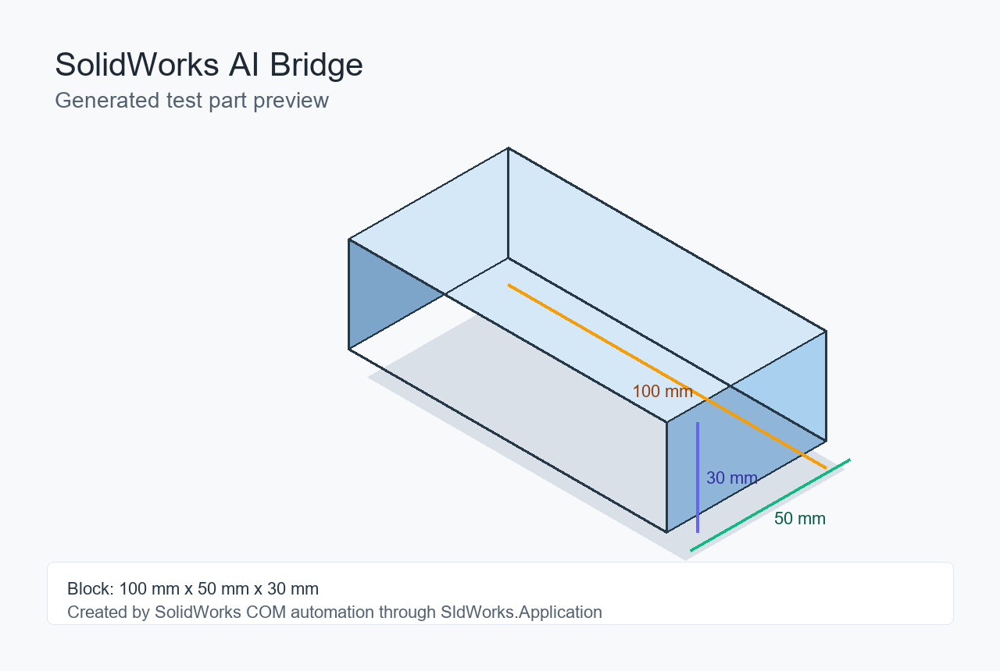

# SolidWorks AI Bridge

[English](README.md) | [中文](README.zh-CN.md)

A portable AI-agent skill for connecting to SolidWorks through the Windows COM Automation API.

It helps local coding agents use `SldWorks.Application` to attach to or launch SolidWorks, check Python dependencies, create a test part, and build task-specific automation for parametric CAD and CAD-to-CAE workflows.

## Example Output

The bundled probe can create a simple 100 mm x 50 mm x 30 mm test part to verify that the full agent-to-SolidWorks automation path works.



## Requirements

- Windows
- SolidWorks installed, licensed, and COM-registered
- Python available on `PATH`
- Local shell execution permission

SolidWorks itself is commercial software and is not installed by this skill. Install SolidWorks through your licensed Dassault/SOLIDWORKS installer, company software center, or administrator-managed package.

## Install

### Codex

Copy this folder to:

```text
%USERPROFILE%\.codex\skills\solidworks-ai-bridge
```

### Claude Code

Copy this folder to:

```text
%USERPROFILE%\.claude\skills\solidworks-ai-bridge
```

Other local agents can use the same folder if they support `SKILL.md`-style skills or can read the instructions and run the bundled script.

## Test

From the skill folder:

```powershell
python .\scripts\sw_probe.py --install-deps
```

Create a test part:

```powershell
python .\scripts\sw_probe.py --create-test-part --output .\solidworks_com_test.SLDPRT
```

Expected output includes:

```text
CONNECTED source=active
VISIBLE True
REVISION <SolidWorks version>
```

`source=active` means it attached to an already open SolidWorks session. `source=dispatch` means it launched or connected through a new COM dispatch.

## Usage Example

Ask your local coding agent:

```text
Use the solidworks-ai-bridge skill to connect to SolidWorks, create a parameterized pipe model, and export STEP geometry for Fluent.
```

## Repository Contents

```text
solidworks-ai-bridge/
├── SKILL.md
├── README.md
├── README.zh-CN.md
├── docs/
│   └── images/
│       └── solidworks-ai-bridge-test-part.png
└── scripts/
    └── sw_probe.py
```

## License

MIT
