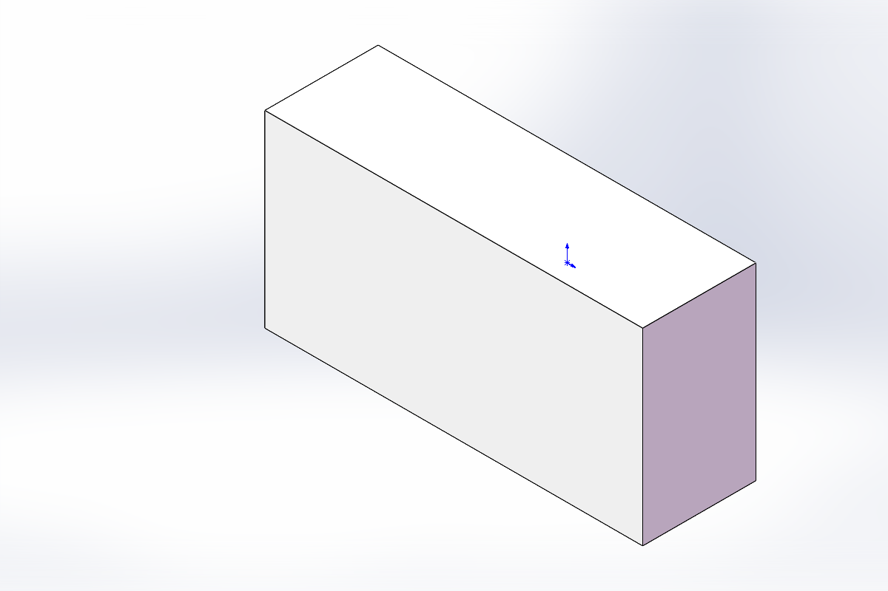
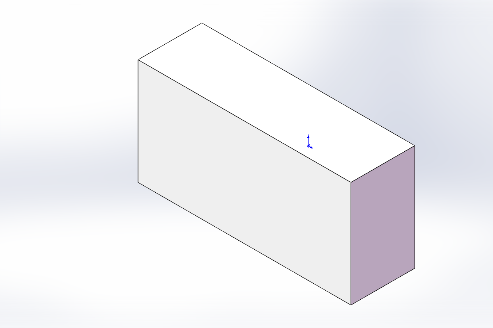

# SolidWorks AI Bridge

> Connect local AI agents to SolidWorks through the SolidWorks COM Automation API.

## Language / 语言

- [中文](README.md)
- [English](README_en.md)

## What is this?

`solidworks-ai-bridge` is a lightweight Skill for local AI coding agents such as Codex and Claude Code. It helps an agent connect to the local SolidWorks application and automate CAD operations through the Windows COM Automation entrypoint:

```text
SldWorks.Application
```

It can help agents:

- Attach to an already open SolidWorks session
- Launch SolidWorks through COM when possible
- Check and install the Python dependency `pywin32`
- Create a test part to verify the automation path
- Extend toward parametric modeling, STEP/Parasolid export, and CFD preprocessing workflows

## Example: Real SolidWorks Export

The following image was exported from an actual SolidWorks test part through COM automation.



More exported examples:

| Part | Preview |
| --- | --- |
| `codex_sw_block_test.SLDPRT` |  |
| `codex_sw_block_test_from_script.SLDPRT` |  |
| `skill_sw_block_test.SLDPRT` |  |
| `solidworks_ai_bridge_test.SLDPRT` |  |
| `零件3.SLDPRT` |  |

## Requirements

- Windows
- SolidWorks installed, licensed, and COM-registered
- Python available on `PATH`
- Local shell execution permission

SolidWorks is commercial software and is not installed by this skill. Install it through your licensed Dassault/SOLIDWORKS installer, university/company software center, or administrator-managed package.

## Install for Codex

Copy this repository to:

```text
%USERPROFILE%\.codex\skills\solidworks-ai-bridge
```

## Install for Claude Code

Copy this repository to:

```text
%USERPROFILE%\.claude\skills\solidworks-ai-bridge
```

## Quick Test

From the skill directory:

```powershell
python .\scripts\sw_probe.py --install-deps
```

Create a test part:

```powershell
python .\scripts\sw_probe.py --create-test-part --output .\solidworks_com_test.SLDPRT
```

Expected output:

```text
CONNECTED source=active
VISIBLE True
REVISION <SolidWorks version>
```

`source=active` means the script attached to an already open SolidWorks session. `source=dispatch` means it launched or connected through a new COM dispatch.

## Automation Path

```text
AI Agent
  -> SolidWorks COM
  -> Parametric CAD modeling
  -> STEP / Parasolid export
  -> Fluent Meshing / Fluent
  -> Post-processing and result analysis
```

## Repository Structure

```text
solidworks-ai-bridge/
├── SKILL.md
├── README.md
├── README_en.md
├── requirements.txt
├── scripts/
│   └── sw_probe.py
└── docs/
    └── images/
        └── solidworks-exports/
```

## License

MIT
